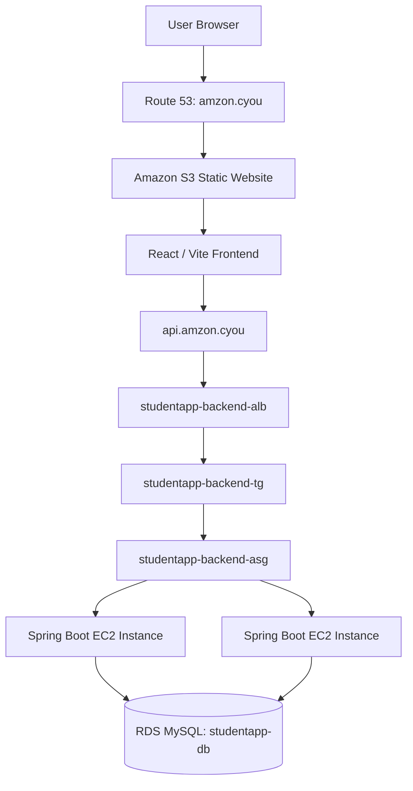

# AWS Student Registration System

A full-stack student registration application deployed on AWS using a React/Vite frontend, a Spring Boot REST API, Amazon EC2 Auto Scaling, an Application Load Balancer, and Amazon RDS for MySQL.

> **Deployment status note:** This README documents the project architecture and the AWS configuration recorded during deployment. Items explicitly marked **Verify in AWS Console** should be checked against the live account before treating them as confirmed. The S3 website endpoint was tested successfully. The root custom domain was changed to use an S3 website alias, but that custom-domain route must be tested after the DNS change. Direct S3 static website hosting uses HTTP, not HTTPS. CloudFront creation was blocked by an AWS account verification restriction, so this README does not claim CloudFront is deployed.

## Table of contents

- [1. Project overview](#1-project-overview)
- [2. Architecture](#2-architecture)
- [3. Technology stack](#3-technology-stack)
- [4. AWS resource inventory](#4-aws-resource-inventory)
- [5. Build order: what was created first and why](#5-build-order-what-was-created-first-and-why)
- [6. VPC and subnet design](#6-vpc-and-subnet-design)
- [7. Internet Gateway, NAT Gateway, and route tables](#7-internet-gateway-nat-gateway-and-route-tables)
- [8. Security groups and allowed traffic](#8-security-groups-and-allowed-traffic)
- [9. Application Load Balancer and target group](#9-application-load-balancer-and-target-group)
- [10. EC2 launch template and Auto Scaling](#10-ec2-launch-template-and-auto-scaling)
- [11. RDS MySQL and database connectivity](#11-rds-mysql-and-database-connectivity)
- [12. Secrets management](#12-secrets-management)
- [13. S3 frontend hosting](#13-s3-frontend-hosting)
- [14. Route 53 DNS records](#14-route-53-dns-records)
- [15. Frontend build and deployment](#15-frontend-build-and-deployment)
- [16. Backend API endpoints](#16-backend-api-endpoints)
- [17. End-to-end request flow](#17-end-to-end-request-flow)
- [18. Verification and testing](#18-verification-and-testing)
- [19. Troubleshooting](#19-troubleshooting)
- [20. Security checklist](#20-security-checklist)
- [21. Current limitations and next steps](#21-current-limitations-and-next-steps)
- [22. Screenshot checklist](#22-screenshot-checklist)
- [23. Repository structure](#23-repository-structure)

---

## 1. Project overview

The Student Registration System is a web application with three main layers:

1. **Frontend:** React.js and Vite provide the user interface.
2. **Backend:** Java and Spring Boot expose REST API endpoints.
3. **Database:** Amazon RDS for MySQL stores application data persistently.

The frontend is hosted in Amazon S3 static website hosting. The backend API is exposed through the API domain and an Application Load Balancer, which sends traffic to EC2 instances managed by an Auto Scaling Group. The backend connects to a private RDS database.

### Project goals

- Host the frontend on AWS.
- Separate frontend, backend, and database responsibilities.
- Use a load balancer to route API traffic to backend instances.
- Maintain backend capacity using EC2 Auto Scaling.
- Keep the database private.
- Control access using security groups and VPC routing.
- Store the database password in Systems Manager Parameter Store rather than committing it to source code.
- Use Route 53 to manage the frontend and API DNS records.

**Repository:** https://github.com/mukitshaikh/aws-student-registration-system

**Region:** `us-east-1` — US East (N. Virginia)

[Screenshot placeholder: Add the application homepage or student registration form.]

## 2. Architecture



### Frontend path

`Browser → Route 53 → S3 website endpoint → React application`

### Backend path

`React application → https://api.amzon.cyou → ALB → target group → EC2 Spring Boot → RDS MySQL`

The frontend and backend are separate. The browser downloads the static frontend files from S3 and then calls the backend API using the configured API base URL.

[Screenshot placeholder: Add an architecture diagram or AWS resource overview.]

## 3. Technology stack

| Layer | Technology / AWS service | Responsibility |
|---|---|---|
| Frontend | React.js, Vite | User interface and production build |
| Static hosting | Amazon S3 | Serves frontend files |
| DNS | Amazon Route 53 | Resolves frontend and API domains |
| API entry point | Application Load Balancer | Receives and forwards backend traffic |
| Backend routing | Target group | Health checks and target selection |
| Compute | Amazon EC2 | Runs Spring Boot |
| Capacity management | EC2 Auto Scaling | Maintains desired backend capacity |
| Database | Amazon RDS for MySQL | Persistent application data |
| Networking | Amazon VPC, subnets, route tables | Network isolation and routing |
| Network security | Security groups | Controls permitted connections |
| Secret storage | Systems Manager Parameter Store | Stores the database password |

## 4. AWS resource inventory

| Resource | Recorded name / value | Purpose |
|---|---|---|
| AWS Region | `us-east-1` | Region used by the project |
| VPC | `studentapp-vpc` | Isolated project network |
| VPC CIDR | `10.0.0.0/16` | Private IPv4 address range |
| Frontend bucket | `amzon.cyou` | Current S3 website bucket |
| Original frontend bucket | `amzon-cyou-frontend` | Earlier frontend bucket |
| Frontend domain | `amzon.cyou` | Root website domain |
| API domain | `api.amzon.cyou` | Backend API domain |
| ALB | `studentapp-backend-alb` | Backend traffic entry point |
| Target group | `studentapp-backend-tg` | Backend target registration and health checks |
| Auto Scaling Group | `studentapp-backend-asg` | Backend capacity management |
| Launch template | `studentapp-backend-lt` | EC2 launch configuration |
| RDS instance | `studentapp-db` | Managed MySQL database |
| Database | `student_db` | Application database |
| DB subnet group | `studentapp-db-subnet-group` | Database subnet placement |
| RDS security group | `studentapp-rds-sg` | Controls database network access |
| Parameter Store name | `/studentapp/db/password` | Database password parameter |

Exact resource IDs, Availability Zones, route table IDs, and all current security-group rules should be copied from the AWS Console. They are not guessed in this document.

## 5. Build order: what was created first and why

The following is the logical dependency order for the infrastructure. Some resources may have been created in a different console sequence during the hands-on work; verify actual creation timestamps in AWS if an exact historical chronology is required.

### Step 1 — Build and test the application

The React/Vite frontend, Spring Boot backend, and MySQL database schema form the application itself.

**Why first:** The infrastructure must support the application's actual API routes, runtime, and database requirements.

[Screenshot placeholder: Add repository structure showing `frontend/` and `backend/`.]

### Step 2 — Create the VPC and subnet plan

Create `studentapp-vpc` with CIDR `10.0.0.0/16`, then create the eight subnets listed in Section 6.

**Why:** The VPC is the network boundary. The ALB, backend EC2 instances, and RDS require network placement before their routing and security can be configured correctly.

[Screenshot placeholder: Add VPC details and subnet list.]

### Step 3 — Configure Internet Gateway, NAT Gateway, and route tables

Attach the Internet Gateway to the VPC. Configure the public route table and private route tables according to the intended network design. Configure NAT routing only for private subnets that need outbound internet access.

**Why:** Subnets need routes to reach the correct destinations. A security group cannot compensate for a missing network route.

[Screenshot placeholder: Add Internet Gateway, NAT Gateway, and route table screenshots.]

### Step 4 — Create security groups

Create and configure the security groups for the ALB, backend EC2 instances, and RDS.

**Why:** Security groups restrict which network connections are allowed. The intended design permits ALB-to-backend traffic on port `8080` and backend-to-database traffic on port `3306`.

[Screenshot placeholder: Add ALB, backend, and RDS security-group rules.]

### Step 5 — Create the RDS subnet group and RDS database

Create `studentapp-db-subnet-group` using the database subnets, then create the MySQL instance `studentapp-db` with database name `student_db` and public access disabled.

**Why:** The backend needs a persistent database endpoint, and the database should remain private rather than being directly accessible from the public internet.

[Screenshot placeholder: Add RDS configuration and connectivity screenshots.]

### Step 6 — Store the database password securely

Store the password in Systems Manager Parameter Store under `/studentapp/db/password`. Configure the backend's runtime permissions and secret retrieval as required by the actual implementation.

**Why:** Secrets should not be hard-coded in source code, committed to GitHub, or placed in public frontend variables.

[Screenshot placeholder: Add Parameter Store parameter name and type; hide the value.]

### Step 7 — Create the backend launch template

Create `studentapp-backend-lt` with the backend runtime configuration, IAM instance profile, backend security group, storage, and startup configuration.

**Why:** The Auto Scaling Group uses the launch template to launch backend instances consistently.

[Screenshot placeholder: Add launch template configuration with secrets removed.]

### Step 8 — Create the target group

Create `studentapp-backend-tg`, configure the backend port as `8080`, and configure the health-check path as `/api/health`.

**Why:** The target group identifies the backend instances that can receive traffic and checks whether they are healthy.

[Screenshot placeholder: Add target group settings and target health.]

### Step 9 — Create the Application Load Balancer

Create `studentapp-backend-alb`, place it in the intended public subnets, attach its security group, and configure its listener rules to forward to `studentapp-backend-tg`.

**Why:** The ALB gives clients a stable backend entry point and distributes traffic to healthy targets. Verify the actual listeners and certificates in the console.

[Screenshot placeholder: Add ALB listeners, subnets, and forwarding rules.]

### Step 10 — Create the Auto Scaling Group

Create `studentapp-backend-asg` using `studentapp-backend-lt`, select the intended backend private subnets, set minimum `2`, desired `2`, and maximum `4`, and attach the target group.

**Why:** Auto Scaling maintains backend capacity and can replace instances when configured health checks or scaling policies require it.

[Screenshot placeholder: Add Auto Scaling Group capacity and subnet settings.]

### Step 11 — Connect and verify the backend

Confirm the Spring Boot service starts on EC2, the target group reports healthy targets, the backend can connect to RDS, and `/api/health` responds successfully through the API domain.

**Why:** DNS and frontend deployment should not be considered complete until the backend route and database connectivity work.

[Screenshot placeholder: Add health endpoint response and healthy target group.]

### Step 12 — Configure the S3 frontend bucket

Use bucket `amzon.cyou`, upload the production Vite build files to the bucket root, and enable static website hosting with `index.html` as the index document. The bucket policy and Block Public Access settings must match the chosen public S3 website design.

**Why:** S3 serves the static frontend without requiring an always-running frontend web server.

[Screenshot placeholder: Add S3 objects, static website hosting, and bucket policy.]

### Step 13 — Configure Route 53 records

Configure the root `amzon.cyou` record to target the S3 **website endpoint** using the supported S3 website alias option, and keep `api.amzon.cyou` as a separate record targeting the backend ALB.

**Why:** The frontend and backend are different destinations and must not share the same DNS target.

[Screenshot placeholder: Add the Route 53 record list and root/API record details.]

### Step 14 — Test the complete user journey

Open the website, load the student list, register a test student, refresh the page, and verify that the data persists in the database. Test the S3 endpoint, custom domain, and API independently so a DNS problem can be distinguished from an application or database problem.

**Why:** A successful page load alone does not prove that the frontend, API, and database are all connected.

[Screenshot placeholder: Add successful test registration using non-sensitive test data.]

## 6. VPC and subnet design

VPC: `studentapp-vpc`  
CIDR: `10.0.0.0/16`  
Region: `us-east-1`

| Intended tier | CIDR | Intended role |
|---|---|---|
| Public subnet 1 | `10.0.1.0/24` | Public-facing resources, such as the ALB or NAT Gateway, as configured |
| Public subnet 2 | `10.0.2.0/24` | Public-facing resources in another Availability Zone, as configured |
| Frontend-design private subnet 1 | `10.0.3.0/24` | Private subnet tier; verify actual resources and route association |
| Frontend-design private subnet 2 | `10.0.4.0/24` | Private subnet tier; verify actual resources and route association |
| Backend private subnet 1 | `10.0.5.0/24` | Intended backend EC2 subnet |
| Backend private subnet 2 | `10.0.6.0/24` | Intended backend EC2 subnet |
| Database private subnet 1 | `10.0.7.0/24` | Intended RDS subnet |
| Database private subnet 2 | `10.0.8.0/24` | Intended RDS subnet |

These labels describe the planned tiers. Verify the actual subnet names, IDs, Availability Zones, and associations in the AWS Console. The S3 static website itself is an AWS-managed service and does not reside in these VPC subnets.

[Screenshot placeholder: Add the VPC subnet list showing all eight CIDRs and Availability Zones.]

## 7. Internet Gateway, NAT Gateway, and route tables

### 7.1 Public route table

The intended public route table contains:

| Destination | Target | Purpose |
|---|---|---|
| `10.0.0.0/16` | `local` | Traffic within the VPC |
| `0.0.0.0/0` | Actual Internet Gateway ID | Internet routing for resources in associated public subnets |

Verify that the Internet Gateway is attached to `studentapp-vpc` and that the public subnets are associated with this route table.

### 7.2 Private route tables

A private route table commonly contains:

| Destination | Target | Purpose |
|---|---|---|
| `10.0.0.0/16` | `local` | Internal VPC traffic |
| `0.0.0.0/0` | Actual NAT Gateway ID, if configured | Outbound internet access for private resources |

Do not assume every private route table uses NAT. Confirm the actual routes. Database subnets should not have a direct default route to the Internet Gateway.

### 7.3 Route-table association checklist

| Route table purpose | Intended subnet associations | Verify |
|---|---|---|
| Public | `10.0.1.0/24`, `10.0.2.0/24` | Route table ID and actual associations |
| Frontend-design private | `10.0.3.0/24`, `10.0.4.0/24` | Route table ID and actual routes |
| Backend private | `10.0.5.0/24`, `10.0.6.0/24` | Route table ID and NAT route, if configured |
| Database private | `10.0.7.0/24`, `10.0.8.0/24` | Route table ID and no direct IGW route |

[Screenshot placeholder: Add the Route Tables list with IDs.]

[Screenshot placeholder: Add each route table's Routes tab.]

[Screenshot placeholder: Add each route table's Subnet associations tab.]

## 8. Security groups and allowed traffic

The intended connection chain is:

```text
Internet clients
      |
      | HTTP/HTTPS only on listeners that are actually configured
      v
ALB security group
      |
      | TCP 8080
      v
Backend EC2 security group
      |
      | TCP 3306
      v
RDS security group: studentapp-rds-sg
```

### 8.1 ALB security group

| Direction | Protocol / port | Source or destination | Purpose |
|---|---|---|---|
| Inbound | TCP 80 | `0.0.0.0/0`, if HTTP listener is enabled | HTTP client access |
| Inbound | TCP 443 | `0.0.0.0/0`, if HTTPS listener is enabled | HTTPS client access |
| Outbound | Backend traffic | Backend security group on port `8080`, as configured | Forward requests to backend |

Only document ports actually enabled in the current ALB.

### 8.2 Backend EC2 security group

| Direction | Protocol / port | Source or destination | Purpose |
|---|---|---|---|
| Inbound | TCP 8080 | ALB security group | Accept API traffic from ALB |
| Inbound | TCP 22, only if enabled | Trusted administrator IP or approved access method | Administration |
| Outbound | TCP 3306, if egress is restricted | RDS security group | Database connection |
| Outbound | TCP 443, if required | Required AWS APIs or update endpoints | Outbound service access |

Do not allow public inbound traffic to port `8080`. If SSH is not required, keep port `22` closed.

### 8.3 RDS security group — `studentapp-rds-sg`

| Direction | Protocol / port | Source or destination | Purpose |
|---|---|---|---|
| Inbound | TCP 3306 | Backend EC2 security group | Permit MySQL from backend |
| Outbound | As configured | Verify in AWS Console | Record actual configuration |

Do not allow MySQL port `3306` from `0.0.0.0/0`. RDS is configured as not publicly accessible.

### 8.4 Important networking distinction

- **Route tables** decide where packets are routed.
- **Security groups** decide which traffic is allowed.
- **Network ACLs**, if customized, provide another subnet-level layer of filtering.
- A correct security-group rule does not fix a missing route, and a route does not automatically grant permission through a security group.

[Screenshot placeholder: Add inbound and outbound rules for the ALB, backend, and RDS security groups. Show rule sources clearly.]

## 9. Application Load Balancer and target group

### Application Load Balancer

- Name: `studentapp-backend-alb`
- VPC: `studentapp-vpc`
- Purpose: receive API traffic and forward it to backend targets.
- Intended placement: public subnets in multiple Availability Zones; verify actual configuration.
- Security group: verify the attached ALB security group.
- Listener ports, certificate, and listener rules: verify in the AWS Console.

### Target group

- Name: `studentapp-backend-tg`
- Backend port: `8080`
- Health-check path: `/api/health`
- Target type and protocol: verify the current configuration.

The health endpoint previously returned `OK`. A healthy target indicates that the configured health check is passing; it does not by itself prove that every application feature works.

[Screenshot placeholder: Add ALB details and listener rules.]

[Screenshot placeholder: Add target-group health-check settings and registered target health.]

## 10. EC2 launch template and Auto Scaling

### Launch template

- Name: `studentapp-backend-lt`
- Purpose: provides the configuration used to launch backend EC2 instances.
- AMI, instance type, IAM instance profile, storage, and user data: verify in AWS Console.

The launch template should contain no plaintext database password or other secrets in its user data.

### Auto Scaling Group

- Name: `studentapp-backend-asg`
- Minimum capacity: `2`
- Desired capacity: `2`
- Maximum capacity: `4`
- Intended subnets: backend private subnets `10.0.5.0/24` and `10.0.6.0/24`; verify actual associations.
- Target group: `studentapp-backend-tg`; verify the attachment.

Auto Scaling manages instance capacity according to the group configuration and any configured scaling policies. Do not assume a CPU-based scaling policy exists unless one is configured.

[Screenshot placeholder: Add the launch template configuration.]

[Screenshot placeholder: Add the Auto Scaling Group capacity, subnet, and target-group settings.]

## 11. RDS MySQL and database connectivity

| Setting | Recorded value |
|---|---|
| DB identifier | `studentapp-db` |
| Engine | MySQL |
| Database name | `student_db` |
| Instance class | `db.t4g.micro` |
| Storage | 20 GB gp3 |
| Public access | Disabled |
| DB subnet group | `studentapp-db-subnet-group` |
| Security group | `studentapp-rds-sg` |
| Port | `3306` |
| Endpoint | `studentapp-db.ckje4akakntr.us-east-1.rds.amazonaws.com` |

The backend connects to RDS through the VPC's private network. The RDS security group should accept MySQL connections from the backend security group, not directly from the internet.

The application should use the database endpoint, database name, username, and securely retrieved password from its runtime configuration. Never place the database password in this README.

[Screenshot placeholder: Add RDS details showing instance status, engine, and public-access status.]

[Screenshot placeholder: Add RDS Connectivity & security showing endpoint, subnet group, Availability Zones, and attached security groups.]

[Screenshot placeholder: Add DB subnet group details.]

## 12. Secrets management

The recorded Systems Manager Parameter Store parameter name is:

`/studentapp/db/password`

The value is a secret and must never be copied into the README or screenshots.

Recommended checks:

1. Confirm the parameter exists in the correct AWS Region.
2. Confirm the backend runtime identity has only the required permission to retrieve it.
3. Confirm the backend reads the parameter using the intended secure configuration.
4. Avoid printing the secret to application logs.
5. Check that no secret is committed in Git history, environment files, or user data.

The actual IAM role and application secret-retrieval implementation must be verified in the repository and AWS Console.

[Screenshot placeholder: Add Parameter Store parameter name/type only; hide the value.]

## 13. S3 frontend hosting

### Current and original buckets

- Current bucket: `amzon.cyou`
- Original bucket: `amzon-cyou-frontend`
- Region: `us-east-1`

The current bucket's static website hosting was enabled and the website endpoint was shown as:

`http://amzon.cyou.s3-website-us-east-1.amazonaws.com`

### Static website settings

- Hosting type: host a static website.
- Index document: `index.html`.
- Error document: `index.html` was entered during setup.
- Build output: upload the contents of Vite's `dist/` directory to the bucket root.
- Access: static website hosting requires publicly readable website content when accessed directly through the S3 website endpoint.

Review the bucket policy and Block Public Access configuration carefully. Do not store private files or secrets in a public website bucket.

### HTTPS limitation

The S3 website endpoint supports HTTP only. Route 53 DNS by itself cannot add HTTPS to an S3 website endpoint. CloudFront creation was blocked by an AWS account verification restriction, so CloudFront is not currently confirmed as deployed.

[Screenshot placeholder: Add S3 Objects tab showing `index.html` and `assets/`.]

[Screenshot placeholder: Add Static website hosting properties.]

[Screenshot placeholder: Add bucket policy and Block Public Access settings.]

## 14. Route 53 DNS records

Hosted zone: `amzon.cyou`

### Frontend root record

The root A alias was configured to target the S3 website endpoint. The intended endpoint is:

`http://amzon.cyou.s3-website-us-east-1.amazonaws.com`

For an S3 website alias, select the S3 **website endpoint** option and the correct Region in Route 53. Do not paste the full `http://` URL into the target selector. If the endpoint does not appear in the selector, verify the bucket's static website hosting and Region, and use the supported target selection offered by Route 53.

The S3 website endpoint was tested successfully, but the custom root domain must be tested again after the DNS change.

### API record

`api.amzon.cyou` is a separate A alias record intended to target the backend ALB. Do not point it to the S3 bucket.

### Other records

- Keep the hosted zone's `NS` and `SOA` records.
- Keep certificate-validation CNAME records unless you verify they are no longer needed.
- The previous `www.amzon.cyou` CNAME was deleted and has not been recreated.
- Amplify was removed from the deployment workflow.

[Screenshot placeholder: Add Route 53 record list.]

[Screenshot placeholder: Add root A alias target details.]

[Screenshot placeholder: Add `api.amzon.cyou` alias target details.]

## 15. Frontend build and deployment

Run these commands from the frontend directory:

```bash
cd frontend
npm install
npm run build
```

Confirm the build output includes:

```text
dist/
├── index.html
└── assets/
```

Upload the contents of `dist/` to the root of the `amzon.cyou` bucket.

Optional AWS CLI command:

```bash
aws s3 sync dist/ s3://amzon.cyou/ --delete --region us-east-1
```

**Warning:** `--delete` removes destination objects that do not exist in the local build. Confirm the bucket name and intended destination before using it.

Then:

1. Open the S3 website endpoint directly.
2. Confirm `index.html` loads.
3. Confirm CSS, JavaScript, and other assets load.
4. Test the custom domain separately after the Route 53 change.
5. Open browser developer tools and check API requests.
6. Rebuild the frontend after changing `VITE_API_URL`, because Vite embeds frontend environment variables into the build.

The recorded frontend API base URL is:

```env
VITE_API_URL=https://api.amzon.cyou
```

Do not put passwords, API secrets, or database credentials in `VITE_` variables; values bundled into frontend code are visible to users.

[Screenshot placeholder: Add successful frontend build output.]

[Screenshot placeholder: Add S3 upload or sync result.]

## 16. Backend API endpoints

The frontend service code uses the following paths:

| Method | Path | Purpose |
|---|---|---|
| `GET` | `/api/health` | Health check |
| `GET` | `/api/users` | Retrieve student records |
| `POST` | `/api/register` | Register a student |
| `DELETE` | `/api/users/{id}` | Delete a student by ID |

The frontend calls the API using:

`https://api.amzon.cyou`

Test the health endpoint:

```bash
curl -i https://api.amzon.cyou/api/health
```

The endpoint previously returned `OK`.

Test the student list:

```bash
curl -i https://api.amzon.cyou/api/users
```

Use non-sensitive test records when demonstrating registration or deletion.

[Screenshot placeholder: Add `/api/health` response.]

[Screenshot placeholder: Add `/api/users` response with non-sensitive sample data.]

## 17. End-to-end request flow

### Loading the frontend

1. The user opens the frontend domain.
2. Route 53 resolves the domain to the configured S3 website alias.
3. S3 serves `index.html` and static assets.
4. The browser runs the React application.

### Retrieving or registering a student

1. The frontend sends an API request to `api.amzon.cyou`.
2. Route 53 resolves the API record to the backend ALB.
3. The ALB listener forwards the request to `studentapp-backend-tg`.
4. The target group routes it to a healthy backend EC2 instance on port `8080`.
5. Spring Boot validates and processes the request.
6. The backend connects to `studentapp-db` over port `3306`.
7. RDS reads or updates data in `student_db`.
8. The backend returns the response through the ALB to the browser.
9. The frontend displays the result.

### Connection matrix

| Source | Destination | Mechanism | Port / protocol |
|---|---|---|---|
| Browser | S3 website | Route 53 root record → S3 website endpoint | HTTP 80 |
| Frontend JavaScript | API domain | `VITE_API_URL` | HTTPS 443 |
| API domain | Backend ALB | Route 53 alias to ALB DNS | Actual ALB listener; verify |
| ALB | Target group | Listener forwarding rule | Backend port 8080 |
| Target group | EC2 | Registered healthy targets | Configured target protocol on port 8080 |
| Backend EC2 | RDS MySQL | Private VPC route and SG permission | TCP 3306 |
| Private resources | Internet, if needed | Route table → NAT Gateway | Outbound routing, where configured |

Route tables and security groups must both allow the required path.

## 18. Verification and testing

Run these checks after DNS or deployment changes:

- [ ] S3 website endpoint opens successfully.
- [ ] `index.html` and frontend assets load.
- [ ] Root domain `amzon.cyou` resolves to the intended S3 website destination.
- [ ] API domain `api.amzon.cyou` resolves to the backend ALB.
- [ ] `GET /api/health` returns the expected response.
- [ ] Target group reports healthy backend targets.
- [ ] `GET /api/users` returns a valid response.
- [ ] A test student can be registered.
- [ ] The student remains after refreshing the page.
- [ ] A test student can be deleted.
- [ ] RDS remains private.
- [ ] Backend-to-RDS connectivity works.
- [ ] Security groups do not expose ports 8080 or 3306 to the public internet.
- [ ] Browser developer tools show no blocking CORS or mixed-content errors.
- [ ] The root custom domain is retested after DNS changes.
- [ ] HTTPS status is accurately reported.

[Screenshot placeholder: Add a successful test registration and refreshed student list using sample data.]

## 19. Troubleshooting

### S3 website returns 403

- Confirm the correct bucket is being used.
- Confirm static website hosting is enabled.
- Confirm `index.html` is at the bucket root.
- Review Block Public Access settings and bucket policy.
- Ensure the bucket policy grants the intended public read access only to public website objects.

### S3 website returns 404

- Confirm `index.html` exists at the root.
- Confirm asset paths and file capitalization.
- Confirm the correct S3 website endpoint is being used.

### Root domain does not load

- Check the Route 53 root record and alias target.
- Confirm the selected target is the S3 website endpoint in `us-east-1`.
- Confirm the bucket website endpoint works directly.
- Allow time for DNS propagation.
- Check the hosted zone's authoritative nameservers with the domain registrar.

### API fails

- Test `https://api.amzon.cyou/api/health`.
- Confirm the API DNS record points to the ALB.
- Confirm the ALB listener forwards to `studentapp-backend-tg`.
- Check target health and `/api/health`.
- Verify port 8080 from the ALB security group to the backend security group.

### Database connection fails

- Verify the endpoint, database name, username, and secure password retrieval.
- Confirm the DB subnet group uses the intended private subnets.
- Confirm port 3306 is allowed from the backend security group.
- Check application logs without printing secrets.
- Do not make RDS public as a troubleshooting shortcut.

### CORS or mixed-content errors

- Configure backend CORS for the actual frontend origin.
- The S3 website currently uses HTTP. If the page is loaded over HTTPS through another delivery service, browser requests to insecure HTTP resources can be blocked as mixed content.
- Configure HTTPS for the frontend before using it for real student data.

## 20. Security checklist

- [ ] No passwords or secret values in README, source code, or screenshots.
- [ ] No AWS access keys, session tokens, or private keys committed to GitHub.
- [ ] Database password is stored securely.
- [ ] RDS public access is disabled.
- [ ] Port 3306 is allowed only from the backend security group.
- [ ] Port 8080 is allowed only from the ALB security group.
- [ ] SSH, if enabled, is restricted to trusted addresses.
- [ ] Public S3 bucket contains only public website files.
- [ ] IAM permissions follow least privilege.
- [ ] Logs do not print credentials or personal data.
- [ ] HTTPS limitations are documented accurately.
- [ ] Live AWS IDs and screenshots are reviewed for unnecessary sensitive information.

## 21. Current limitations and next steps

### Recorded state

- S3 static website hosting was enabled for bucket `amzon.cyou`.
- The S3 website endpoint was tested successfully.
- The root domain was changed toward an S3 website alias.
- The previous Amplify application was deleted.
- The old frontend DNS records were deleted during the migration.
- `api.amzon.cyou` was retained as the backend API record.
- CloudFront creation was blocked by an AWS account verification restriction.

### Verify next

1. Test `http://amzon.cyou` after the DNS change.
2. Confirm the API domain still reaches the backend ALB.
3. Re-test registration, listing, refresh persistence, and deletion end to end.
4. Verify actual route-table IDs and subnet associations.
5. Verify actual ALB, backend, and RDS security-group rules.
6. Recreate `www.amzon.cyou` only if required.
7. Resolve the AWS restriction before attempting CloudFront again.

### HTTPS for the frontend

Direct S3 static website hosting does not support HTTPS. To serve the frontend securely on the custom domain, use an HTTPS-capable delivery service such as CloudFront after the account restriction is resolved. Test the distribution and its origin before changing DNS. Do not point the domain at an unverified distribution.

## 22. Screenshot checklist

Add real screenshots at the placeholders above. Recommended evidence:

1. Application homepage and registration form.
2. GitHub repository structure.
3. VPC details and CIDR.
4. All eight subnets and Availability Zones.
5. Internet Gateway attachment.
6. NAT Gateway details.
7. Public route table routes.
8. Private route table routes and subnet associations.
9. ALB security-group rules.
10. Backend security-group rules.
11. RDS security-group rules.
12. ALB listeners and target group forwarding.
13. Target-group health checks and healthy targets.
14. Launch template.
15. Auto Scaling Group capacity and subnets.
16. RDS details and private connectivity.
17. DB subnet group.
18. Parameter Store parameter name with value hidden.
19. S3 objects and website hosting.
20. S3 public access settings and bucket policy.
21. Route 53 root and API records.
22. S3 website endpoint loading.
23. API health response.
24. Successful registration using test data.

Never include passwords, secret values, access keys, session tokens, or real student data in screenshots.

## 23. Repository structure

The recorded high-level repository layout is:

```text
aws-student-registration-system/
├── README.md
├── .gitignore
├── aws/
├── backend/
└── frontend/
    ├── public/
    ├── src/
    │   └── api/
    │       └── userService.js
    ├── index.html
    ├── package.json
    └── vite.config.js
```

Verify the exact files in GitHub before relying on this tree as a complete inventory.

### Frontend API service paths

The frontend API service uses:

- `GET ${BASE_URL}/api/users`
- `POST ${BASE_URL}/api/register`
- `DELETE ${BASE_URL}/api/users/${id}`

The API base URL is configured through `VITE_API_URL`. The production build must be rebuilt and uploaded after changing that value.

---

## Conclusion

This project demonstrates how a full-stack web application can use AWS for static hosting, DNS, network segmentation, load balancing, scalable compute, private database access, and secret storage.

The main architecture is:

**React/Vite on S3 → Route 53/API domain → Application Load Balancer → Target group → EC2 Auto Scaling with Spring Boot → private RDS MySQL.**

Before presenting the project as fully verified, confirm the live DNS path, route-table associations, security-group rules, and end-to-end registration flow in the AWS Console.
